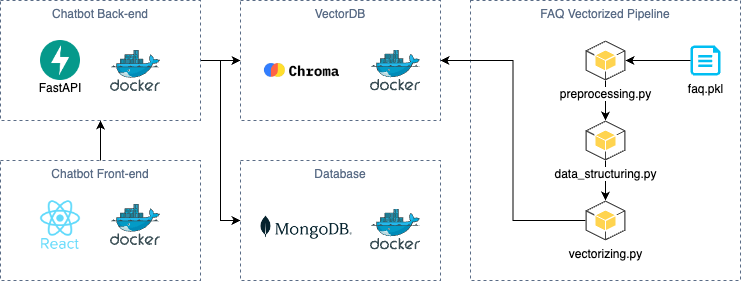

# 네이버 스마트 스토어 FAQ 응대 챗봇

## Description

네이버 스마트스토어의 자주 묻는 질문(FAQ)를 기반으로 질의응답을 하는 챗봇을 구현합니다.

네이버 스마트 스토어의 2,717개 한글 FAQ 데이터를 사용합니다.

네이버 스마트 스토어의 FAQ를 근거로 답변을 제공해야 합니다.

## Prerequisite

- [Docker](https://www.docker.com/)

이 애플리케이션은 Python으로 작성되어 있습니다.

로컬 환경에서 애플리케이션을 손쉽게 구성할 수 있도록, 간단한 Docker Compose 파일을 제공하고 있습니다.

Docker Compose에서 설치되는 이미지는 다음과 같습니다.

- Python 3.12.7 (Dockerfile)
- ChromaDB 0.6.0
- MongoDB 8.0.4

## Installation & Running With Docker

### 실행

```shell
docker-compose up --build -d
```

이미지를 빌드하고 컨테이너를 실행합니다.

### 종료

```shell
docker-compose down --build -d
```

실행중인 컨테이너를 종료합니다.

## 요구사항 분석 및 설계

<details>
  <summary>주요 기능 및 성능 요구사항</summary>

- 목표: 네이버 스마트스토어의 자주 묻는 질문(FAQ)을 기반으로 질의응답하는 챗봇 만들기
- [참고 링크](https://help.sell.smartstore.naver.com/index.help)
- [FAQ 데이터](./faq/final_result.pkl)
- 프레임워크 & 라이브러리
  - Backend: [FastAPI](https://fastapi.tiangolo.com/ko/)
    - Streaming: FastAPI - [StreamingResponse](https://fastapi.tiangolo.com/advanced/custom-response/#streamingresponse)
  - Frontend:
    - UI: [React](https://ko.legacy.reactjs.org/)
    - Style: [tailwindcss](https://tailwindcss.com/)
  - Embedding: [chromadb](https://github.com/chroma-core/chroma)
    - [OpenAIEmbeddingFunction](https://docs.trychroma.com/integrations/embedding-models/openai)
    - model_name = [text-embedding-3-small](https://platform.openai.com/docs/guides/embeddings)
  - LLM: [openai](https://github.com/openai/openai-python)
  - Database: [MongoDB](https://www.mongodb.com/)
    - [motor](https://www.mongodb.com/ko-kr/docs/drivers/motor/#std-label-python-async-driver)
  - Evaluation: [RAGAS](https://docs.ragas.io/en/stable/)
- 임베딩/LLM 모델 사양 및 가격
  - text-embedding-3-small
    - Output Dimension: 1,536
    - $0.020 / 1M tokens
  - gpt-4o-mini
    - Context Window: 128,000 tokens
    - Max Output Tokens: 16,384 tokens
    - $0.150 / 1M input tokens
    - $0.600 / 1M output tokens
- 기능 요구사항
  - [ ] 001 FAQ 데이터 기반으로 답변 제공
  - [ ] 002 대화 맥락을 저장
  - [ ] 003 대화 맥락을 기반으로 답변 제공
    - [ ] 003-1 이전 질문과 상황을 토대로 적절한 답변을 제공
    - [ ] 003-2 전체적인 대화 기록을 토대로 적절한 답변을 제공
  - [ ] 004 대화 맥락을 기반으로 추가 질문 제시
  - [ ] 005 스마스스토어와 관련없는 내용은 답변하지 않음
  - [ ] 006 스트리밍 방식의 채팅 제공
- 비기능 요구사항
  - [ ] 001 Faithfulness, Answer Relevancy 0.8 이상

</details>

<details>
  <summary>시스템 아키텍처</summary>

  

로컬 환경에서 동일한 실행 환경을 제공하기 위해 Back-end, Front-end, VectorDB, Database를 모두 Docker 컨테이너로 구성하여 제공합니다.

또한, 초기 데이터 적재를 위해 FAQ를 벡터화하는 파이프라인을 제공합니다. 이는 로컬에서 초기에 한번만 실행해주면 됩니다.

파이프라인은 3가지 단계로 이루어집니다.

1. 전처리(preprocessing.py): FAQ 내용 중 관련성이 적은 단어, 문장, 특수문자등을 제외하여 데이터 품질을 향상시킵니다.
2. 구조화(data_structuring.py): 제목과 내용을 분리하여 구조화합니다.
3. 벡터화(vectorizing.py): 구조화된 내용을 벡터화하여 ChromaDB에 저장합니다.

</details>

## 기타

<details>
  <summary>Commit convention</summary>

- 커밋 컨벤션은 [Conventional Commit](https://www.conventionalcommits.org/en/v1.0.0/) 규칙을 사용합니다.
- Git Emoji는 [gitmoji](https://gitmoji.dev/)를 사용합니다.

</details>

<details>
  <summary>Code linter/formatter</summary>

Linter/Formatter 로 [ruff](https://docs.astral.sh/ruff/) 패키지를 사용합니다.

pre-commit hook을 적용하려면 다음 명령어를 따라하세요:

```shell
poetry run pre-commit install
```

Lint:

```sh
poetry run ruff check
```

Lint with fix:

```sh
poetry run ruff check --fix
```

Format:

```sh
poetry run ruff format
```

</details>

