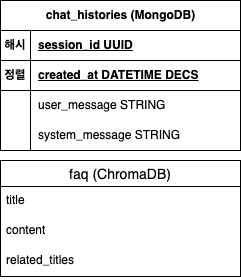

# 네이버 스마트 스토어 FAQ 응대 챗봇

## Description

네이버 스마트스토어의 자주 묻는 질문(FAQ)를 기반으로 질의응답을 하는 챗봇을 구현합니다.

네이버 스마트 스토어의 2,717개 한글 FAQ 데이터를 사용합니다.

네이버 스마트 스토어의 FAQ를 근거로 답변을 제공해야 합니다.

## Prerequisite

- [Docker](https://www.docker.com/)

이 애플리케이션은 Python으로 작성되어 있습니다.

로컬 환경에서 애플리케이션을 손쉽게 구성할 수 있도록, 간단한 Docker Compose 파일을 제공하고 있습니다.

Docker Compose에서 설치되는 이미지는 다음과 같습니다.

- Python 3.12.7 (Dockerfile)
- ChromaDB 0.6.0
- MongoDB 8.0.4

## Environment Variables

`.env.template` 참고

```
OPEN_AI_KEY=sk-proj-... # OPEN_AI_KEY
```

## Installation & Running With Docker

### 실행

```shell
docker-compose up --build -d
```

이미지를 빌드하고 컨테이너를 실행합니다.

### 종료

```shell
docker-compose down --build -d
```

실행중인 컨테이너를 종료합니다.

## Seeding FAQ embeddings

2,717개의 FAQ를 임베딩합니다. OpenAI의 `text-embedding-3-small` 모델을 사용합니다.

의존성 설치를 위한 [poetry](https://python-poetry.org/)와 OPEN_AI_KEY 환경 변수가 필요합니다.

### 의존성 설치

```sh
poetry install
```

### 임베딩

임베딩 스크립트를 실행하기전에 ChromaDB의 도커로
실행해주세요: [Installation & Running With Docker](#installation--running-with-docker) 참고

```sh
poetry run python scripts/vectorizing.py
```

> 💡 시간이 꽤 소모되기 때문에 장시간 자리를 비울 경우 [caffeinate](https://seorenn.tistory.com/61)를 고려해보세요.

## 요구사항 분석 및 설계

<details>
  <summary>주요 기능 및 성능 요구사항</summary>

- 목표: 네이버 스마트스토어의 자주 묻는 질문(FAQ)을 기반으로 질의응답하는 챗봇 만들기
- [참고 링크](https://help.sell.smartstore.naver.com/index.help)
- [FAQ 데이터](./faq/final_result.pkl)
- 프레임워크 & 라이브러리
  - Backend: [FastAPI](https://fastapi.tiangolo.com/ko/)
    - Streaming: FastAPI - [StreamingResponse](https://fastapi.tiangolo.com/advanced/custom-response/#streamingresponse)
  - Frontend:
    - UI: [React](https://ko.legacy.reactjs.org/)
    - Style: [tailwindcss](https://tailwindcss.com/)
  - Embedding: [chromadb](https://github.com/chroma-core/chroma)
    - [OpenAIEmbeddingFunction](https://docs.trychroma.com/integrations/embedding-models/openai)
    - model_name = [text-embedding-3-small](https://platform.openai.com/docs/guides/embeddings)
  - LLM: [openai](https://github.com/openai/openai-python)
  - Database: [MongoDB](https://www.mongodb.com/)
    - [motor](https://www.mongodb.com/ko-kr/docs/drivers/motor/#std-label-python-async-driver)
  - Evaluation: [RAGAS](https://docs.ragas.io/en/stable/)
  - TTL Cache: [cachetools](https://github.com/tkem/cachetools/)
- 임베딩/LLM 모델 사양 및 가격
  - text-embedding-3-small
    - Output Dimension: 1,536
    - $0.020 / 1M tokens
  - gpt-4o-mini
    - Context Window: 128,000 tokens
    - Max Output Tokens: 16,384 tokens
    - $0.150 / 1M input tokens
    - $0.600 / 1M output tokens
- 기능 요구사항
  - [ ] 001 FAQ 데이터 기반으로 답변 제공
  - [ ] 002 대화 맥락을 저장
  - [ ] 003 대화 맥락을 기반으로 답변 제공
    - [ ] 003-1 이전 질문과 상황을 토대로 적절한 답변을 제공
    - [ ] 003-2 전체적인 대화 기록을 토대로 적절한 답변을 제공
  - [ ] 004 대화 맥락을 기반으로 추가 질문 제시
  - [ ] 005 스마스스토어와 관련없는 내용은 답변하지 않음
  - [ ] 006 스트리밍 방식의 채팅 제공
- 비기능 요구사항
  - [ ] 001 Faithfulness, Answer Relevancy 0.8 이상

</details>

<details>
  <summary>시스템 아키텍처</summary>
  

로컬 환경에서 동일한 실행 환경을 제공하기 위해 Back-end, Front-end, VectorDB, Database를 모두 Docker 컨테이너로 구성하여 제공합니다.

또한, 초기 데이터 적재를 위해 FAQ를 벡터화하는 파이프라인을 제공합니다. 이는 로컬에서 초기에 한번만 실행해주면 됩니다.

파이프라인은 3가지 단계로 이루어집니다.

1. 전처리(preprocessing.py): FAQ 내용 중 관련성이 적은 단어, 문장, 특수문자등을 제외하여 데이터 품질을 향상시킵니다.
2. 구조화(data_structuring.py): 제목과 내용을 분리하여 구조화합니다.
3. 벡터화(vectorizing.py): 구조화된 내용을 벡터화하여 ChromaDB에 저장합니다.

</details>

<details>
  <summary>ERD</summary>
  

ERD는 매우 심플하게 구성했습니다. 이번 과제의 본질에 벗어나지 않게, 인증, 유저와 같은 데이터는 구현하지 않습니다.

테이블 설계는 `Amazon DynamoDB`의 파티셔닝 이론에 착안하여 설계되었습니다. MongoDB에서는 Hash Index로 호환됩니다.

채팅은 여러 세션이 있을 수 있고, `session_id`로 구분됩니다. `session_id`는 DynamoDB의 파티션키에 해당합니다.

즉, 하나의 세션에는 여러 대화가 존재하며, `session_id`로 쿼리하면 해당 세션의 대화를 조회할 수 있습니다.

그리고 최신 채팅을 항상 먼저 보여줘야하기 때문에 `created_at`을 정렬키로 설정합니다. (이번 과제에서 커서 기반 페이지네이션은 고려하지 않습니다.)

chat_vectorized는 대화 문맥을 검색하기 위한 VectorDB 입니다.

대화를 하고 있는 session의 문맥만을 참고하기 위해, session_id를 메타데이터로 설정합니다.

</details>

<details>
<summary>API</summary>

### API 목록

- GET /v1/sessions
  - 설명: 모든 세션 목록을 불러옵니다.
  - 성공(200):
    - Array
      - `session_id: string`: 세션 ID
      - `first_message: string`: 사용자의 첫번째 메세지 (UI 용)

- GET /v1/sessions/{session_id}/chats
  - 설명: 특정 세션의 대화 목록을 불러옵니다.
  - 파라미터:
    - `session_id: string`: 세션 ID
  - 성공(200):
    - Array
      - `session_id: string`: 세션 ID
      - `user_message`: 유저 메세지 (질문)
      - `system_message`: 시스템 메세지 (답변)

- POST /v1/sessions/{session_id}/chats
  - 설명: 특정 세션에 유저 메세지를 보냅니다. 스트리밍 ID를 반환 받습니다.
  - 파라미터
    - `session_id: string`: 세션 ID
  - 요청 본문:
    - `user_message`: 유저 메세지 (질문)
  - 성공(201):
    - `session_id: string`: 세션 ID
    - `streaming_id: string`: SSE 통신을 위한 스트리밍 키

- POST /v1/streaming/{streaming_id}
  - 설명: 특정 스트리밍 id를 이용하여 답변에 대한 스트리밍을 받습니다.
  - 파라미터:
    - `streaming_id: string`: 세션 ID
  - 성공(200):
    - SSE 스트리밍 메세지
  - 실패(404):
    - `error_message: "streaming_id"가 존재하지 않습니다.`
</details>

<details>
  <summary>시퀀스 다이어그램</summary>

### 대화 세션 목록 조회

```mermaid
sequenceDiagram
    User ->> API: GET /v1/sessions 호출
    API ->> UseCase: find_all_chat_sessions_use_case.execute() 호출
    UseCase ->> Repository: chat_sessions_repository.find_all() 호출
    Repository -->> UseCase: ChatSession[] 반환
    UseCase -->> API: ChatSession[] 반환
    API -->> User: ChatSession[] 반환
```



### 특정 세션의 대화 목록 조회

```mermaid
sequenceDiagram
    User ->> API: GET /v1/sessions/{session_id}/chats 호출
    API ->> UseCase: find_chats_by_session_id_use_case.execute() 호출
    UseCase ->> Repository: chat_repository.find_by_session_id() 호출
    Repository -->> UseCase: Chat[] 반환
    UseCase -->> API: Chat[] 반환
    API -->> User: Chat[] 반환
```



### 유저 메시지 전송 (작업 큐에 전송)

```mermaid
sequenceDiagram
    User ->> API: POST /v1/sessions/{session_id}/chats 호출
    API ->> UseCase: send_user_message_use_case.execute(session_id, user_message) 호출
    UseCase ->> LLMQueue: llm_queue_service.add(session_id, user_message) 호출 (TTL 1분)
    LLMQueue -->> UseCase: streaming_id 반환
    UseCase -->> API: session_id, streaming_id 반환
    API -->> User: 201 session_id, streaming_id 반환
```



1분 이내로 스트리밍을 호출하지 않으면, LLMQueue에서 스트리밍 ID를 삭제합니다.

### LLM 응답 스트리밍

```mermaid
sequenceDiagram
    User ->> API: POST /v1/streaming/{streaming_id} 호출
    API ->> UseCase: streaming_system_message_use_case.execute(streaming_id) 호출
    UseCase ->> LLMQueue: llm_queue_service.get(streaming_id) 호출
    alt 스트리밍 존재
        LLMQueue -->> UseCase: session_id, user_message 반환
        UseCase ->> VectorDB: vector_db_service.find_related_documents(user_message, limit=n) 호출
        VectorDB -->> UseCase: related_n_documents 반환
        UseCase ->> Repository: chat_repository.find_recent_chats(session_id, limit=n) 호출
        Repository -->> UseCase: recent_n_chats 반환
        UseCase --> LLMRAG: llm_rag_service.send_question(user_message, related_n_documents, recent_n_chats) 호출
        LLMRAG --> UseCase: system_message를 스트리밍 방식으로 전송
        UseCase -->> API: system_message를 스트리밍 방식으로 전송
        API -->> User: 200 system_message를 스트리밍 방식으로 전송 (SSE)
        UseCase ->> Repository: chat_repository.save(session_id, user_message, system_message) 저장
        Repository -->> UseCase: 저장 성공
    else 스트리밍 없음
        Repository -->> UseCase: null 반환
        UseCase -->> API: null 반환
        API -->> User: 404 "streaming_id"가 존재하지 않습니다.
    end
```


</details>

## 기타

<details>
  <summary>E2E 테스트 코드</summary>

`naver_smart_store_rag_chatbot/test_e2e.py`에 E2E 테스트를 구현했습니다.

### 의존성 설치

```sh
poetry install
```

### 테스트 실행

```sh
poetry run pytest
```

</details>

<details>
  <summary>Commit convention</summary>

- 커밋 컨벤션은 [Conventional Commit](https://www.conventionalcommits.org/en/v1.0.0/) 규칙을 사용합니다.
- Git Emoji는 [gitmoji](https://gitmoji.dev/)를 사용합니다.

</details>

<details>
  <summary>Code linter/formatter</summary>

Linter/Formatter 로 [ruff](https://docs.astral.sh/ruff/) 패키지를 사용합니다.

pre-commit hook을 적용하려면 다음 명령어를 따라하세요:

```shell
poetry run pre-commit install
```

Lint:

```sh
poetry run ruff check
```

Lint with fix:

```sh
poetry run ruff check --fix
```

Format:

```sh
poetry run ruff format
```

</details>

